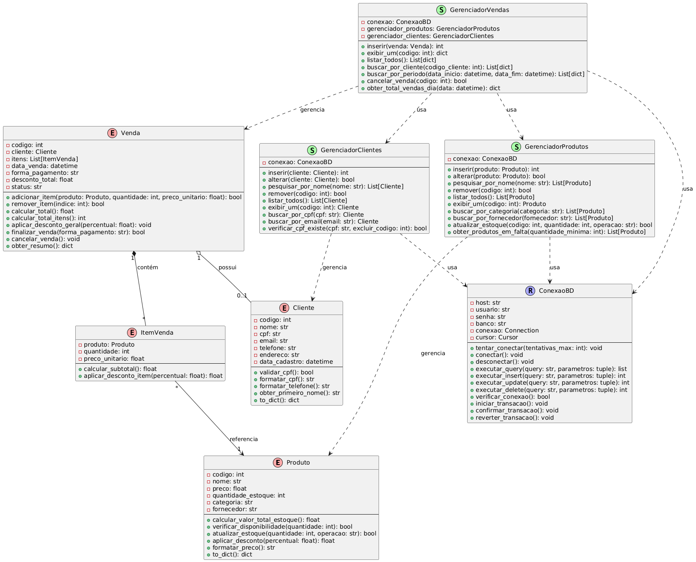

# Sistema de Supermercado

Sistema CRUD completo para gerenciamento de supermercado com Docker, MySQL e Streamlit.


## Diagrama UML




## Tecnologias Utilizadas

- **Python**
- **Streamlit** - p/ Interface web
- **MySQL** - p/ Banco de dados
- **Docker** - Containerização e Interoperabilidade


## Como Executar

1. Certifique-se de ter o Docker e Docker Compose instalados

2. Na pasta do projeto, execute:
```bash
cd supermercado
docker-compose up --build
```

3. Aguarde os containers iniciarem e acesse:
   - Aplicação: http://localhost:8501
   - MySQL: localhost:3306 (usuário: usuario, senha: senha123)
